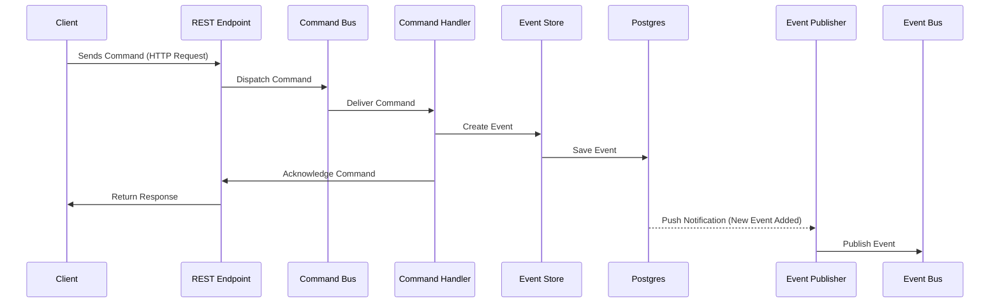

# Event Store

Here's a sequence diagram for when a client sends a command.

```mermaid
sequenceDiagram
    participant Client
    participant API as REST Endpoint
    participant CommandBus as Command Bus
    participant Handler as Command Handler
    participant EventStore as Event Store
    participant Postgres
    participant EventPublisher as Event Publisher
    participant EventBus as Event Bus

    Client->>API: Sends Command (HTTP Request)
    API->>CommandBus: Dispatch Command
    CommandBus->>Handler: Deliver Command
    Handler->>EventStore: Create Event
    EventStore->>Postgres: Save Event
    Handler->>API: Acknowledge Command
    API->>Client: Return Response
    Postgres-->>EventPublisher: Push Notification (New Event Added)
    EventPublisher->>EventBus: Publish Event
```
