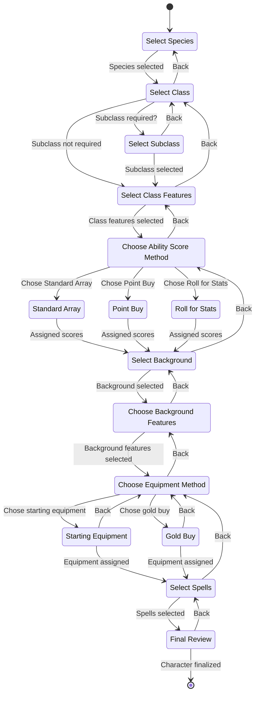

# State machine

_Automata_ uses a state machine to track a user's progress through the character creation process. This ensures that the user makes valid choices and follows a logical progression. The state machine is implemented using XState, a library for creating state machines and statecharts in JavaScript.

